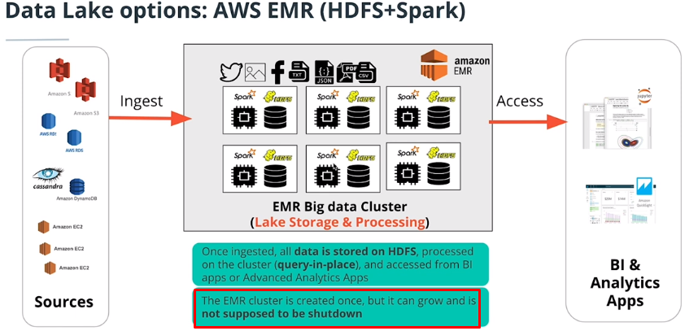

# AWS for Data Analysis using spark

This study has the objective to test AWS services for data analysis.

##Abstract
The idea of this project was to test a spark cluster in EMR using S3 as a data lake

##Main Learning
- EMR is an easy and quick way to raise a spark cluster with numerous other hadoop services. 
- An easy way to interact with the pyspark is the jupyter lab. Interface built automatically by the cluster for interaction with the pyspark kernel via notebook
- Using spark is quick and easy to read s3 partitioned data
> df = spark.read.json('s3://udacity-dend/song_data//*//*//*//*.json')
> df.write.partitionBy("artist_id").mode("append").parquet(output_s3)
- For production processing, it was seen how to submit a .py file
- Spark is a great tool for large-scale use, but it has a large overhead for small datasets

##Architecture
Using EMR it is possible to maintain or separate processing from storage.
###Processing and storage as the same cluster

###Separate processing and storage

##Introduction about the project
A music streaming startup, Sparkify, has grown their user base and song database even more and want to move their data warehouse to a data lake. Their data resides in S3, in a directory of JSON logs on user activity on the app, as well as a directory with JSON metadata on the songs in their app.

As their data engineer, you are tasked with building an ETL pipeline that extracts their data from S3, processes them using Spark, and loads the data back into S3 as a set of dimensional tables. This will allow their analytics team to continue finding insights in what songs their users are listening to.

You'll be able to test your database and ETL pipeline by running queries given to you by the analytics team from Sparkify and compare your results with their expected results.

##Project Description
In this project, you'll apply what you've learned on Spark and data lakes to build an ETL pipeline for a data lake hosted on S3. To complete the project, you will need to load data from S3, process the data into analytics tables using Spark, and load them back into S3. You'll deploy this Spark process on a cluster using AWS.

##Project Datasets
You'll be working with two datasets that reside in S3. Here are the S3 links for each:

- Song data: s3://udacity-dend/song_data
- Log data: s3://udacity-dend/log_data

##Song Dataset
The first dataset is a subset of real data from the Million Song Dataset. Each file is in JSON format and contains metadata about a song and the artist of that song. The files are partitioned by the first three letters of each song's track ID. For example, here are filepaths to two files in this dataset.

- song_data/A/B/C/TRABCEI128F424C983.json
- song_data/A/A/B/TRAABJL12903CDCF1A.json

And below is an example of what a single song file, TRAABJL12903CDCF1A.json, looks like.

{"num_songs": 1, "artist_id": "ARJIE2Y1187B994AB7", "artist_latitude": null, "artist_longitude": null, "artist_location": "", "artist_name": "Line Renaud", "song_id": "SOUPIRU12A6D4FA1E1", "title": "Der Kleine Dompfaff", "duration": 152.92036, "year": 0}

##Log Dataset
The second dataset consists of log files in JSON format generated by this [event simulator](https://github.com/Interana/eventsim) based on the songs in the dataset above. These simulate app activity logs from an imaginary music streaming app based on configuration settings.

The log files in the dataset you'll be working with are partitioned by year and month. For example, here are filepaths to two files in this dataset.

- log_data/2018/11/2018-11-12-events.json
- log_data/2018/11/2018-11-13-events.json

## Schema for Song Play Analysis
Using the song and log datasets, you'll need to create a star schema optimized for queries on song play analysis. This includes the following tables.

###Fact Table
- songplays - records in log data associated with song plays i.e. records with page NextSong
	
	songplay_id, start_time, user_id, level, song_id, artist_id, session_id, location, user_agent

###Dimension Tables
1. users - users in the app
	- user_id, first_name, last_name, gender, level
2. songs - songs in music database
	- song_id, title, artist_id, year, duration
3. artists - artists in music database
	- artist_id, name, location, lattitude, longitude
4. time - timestamps of records in songplays broken down into specific units
	- start_time, hour, day, week, month, year, weekday

##Project Template
To get started with the project, go to the workspace on the next page, where you'll find the project template. You can work on your project with a smaller dataset found in the workspace, and then move on to the bigger dataset on AWS.

Alternatively, you can download the template files in the Resources tab in the classroom and work on this project on your local computer.

The project template includes three files:

- <b>SparkTest.ipynb</b> Created to do some important tests (nice to see)
- <b>etl.py</b> reads data from S3, processes that data using Spark, and writes them back to S3
- <b>dl.cfg</b> contains your AWS credentials
- <b>README.md</b> provides discussion on your process and decisions

## EXTRAS

- To use Spark SQL is necessary to install Hive in the cluster
- Spark has a good logging interface to monitor execution (Spark WebUI) for JOB -> Stages -> Tasks

